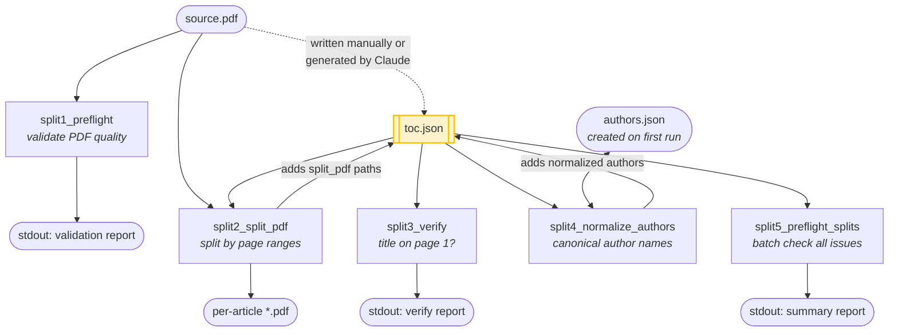
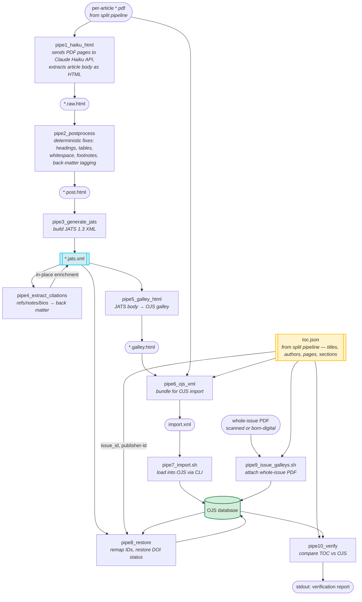

# Backfill Toolkit

Tools for digitising a journal's print archive into OJS. Takes whole-issue PDFs and produces per-article PDFs, HTML galleys, JATS 1.3 XML, and OJS Native XML for import.

## Pipeline

```
Issue PDF → toc.json (metadata) → split PDFs → HTML galleys (AI) → JATS XML → OJS import
```

### Split pipeline (split1–split5)



### HTML pipeline (pipe1–pipe10)



1. **Create `toc.json`** — describe each article's title, authors, pages, and section. Can be generated by Claude from the PDF, or written manually. See the [TOC guide](../docs/backfill-toc-guide.md) for the schema.
2. **`validate_toc.py`** — validate toc.json schema. Both pipelines consume it; validate before running either.
3. **`split_pipeline/split_issue.sh <issue.pdf>`** — validates the PDF, splits it into per-article PDFs using page ranges from toc.json, normalizes author names.
4. **`html_pipeline/pipe1_haiku_html.py`** — sends each split PDF to the Claude Haiku API and generates an HTML body (`.raw.html`). Resumable (skips existing files).
5. **`html_pipeline/pipe2_postprocess.py`** — deterministic post-processing: `.raw.html` → `.post.html`. Free, rerunnable.
6. **`html_pipeline/pipe3_generate_jats.py`** — produces one JATS 1.3 XML file per article from toc.json metadata + processed HTML body. JATS is the single source of truth.
7. **`html_pipeline/pipe4_extract_citations.py`** — finds reference sections in the JATS body, extracts items, writes structured references to `<ref-list>` and notes to `<fn-group>`. See [citation classification rules](../docs/citation-classification.md).
8. **`html_pipeline/pipe4b_match_dois.py`** — matches extracted references against Crossref DOIs. Writes `<pub-id>` elements to JATS. Optional — skip during QA iteration, run once when refs are finalized. Results cached in `doi_matches.json`. See [Crossref reference linking](../docs/crossref-reference-linking.md).
9. **`html_pipeline/pipe5_galley_html.py`** — regenerates HTML galleys from JATS (body + notes + bios; references excluded since OJS renders those from its citations table).
10. **`html_pipeline/pipe6_ojs_xml.py`** — produces OJS Native XML with base64-embedded PDFs and HTML galleys, ready for import.
11. **`html_pipeline/pipe7_import.sh <issue-dir>`** — loads the generated XML into OJS via Docker CLI.

## Directory structure

| Directory | Purpose |
|-----------|---------|
| `split_pipeline/` | PDF split pipeline: split1-split5 numbered scripts + `split_issue.sh` orchestrator |
| `html_pipeline/` | HTML extraction pipeline: pipe1-pipe10 numbered scripts |
| `html_pipeline/tools/` | Utility scripts (snapshot_ids, sheets_export) |
| `html_pipeline/qa/` | QA review CLI |
| `lib/` | Shared library code (citations, postprocess, pdf_utils) |
| `tests/` | Fixture-driven regression tests |

## Documentation

- [Backfill Pipeline](../docs/backfill-pipeline.md) — process guide for reviewers (no terminal needed)
- [Backfill Reference](../docs/backfill-reference.md) — technical reference for all commands and workflows
- [TOC Guide](../docs/backfill-toc-guide.md) — toc.json schema and creation instructions
- [Citation Classification](../docs/citation-classification.md) — how extracted items are classified (references, notes, bios, provenance)
- [blast-queue.sh](../docs/blast-queue.md) — draining the OJS job queue after import (DOI deposits, notifications)

## Data directory

`backfill/private/output/<vol>.<iss>/` contains per-issue output: toc.json (metadata), split PDFs, HTML galleys, JATS XML, and OJS import XML. This directory is gitignored — journal-specific data lives in a separate private repository (accessed via the `backfill/private` symlink). The scripts work with any local `backfill/private/output/` directory regardless of where the data comes from.
