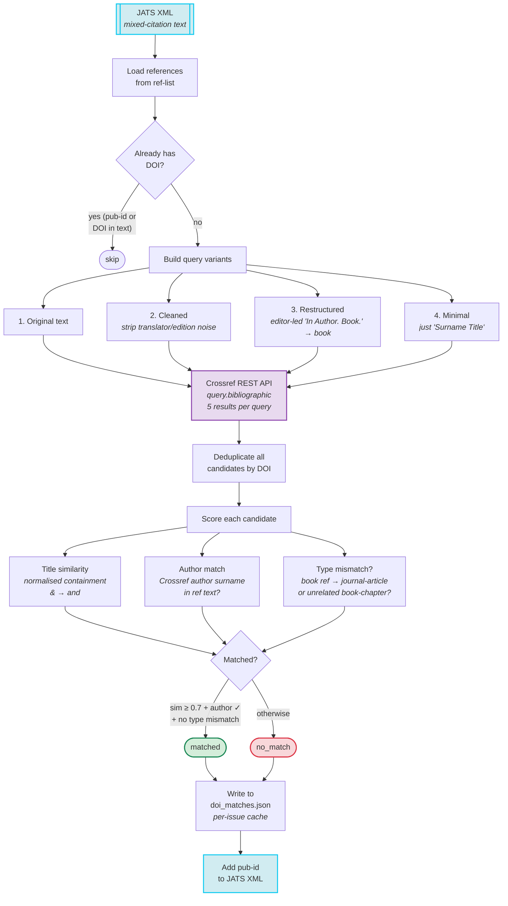
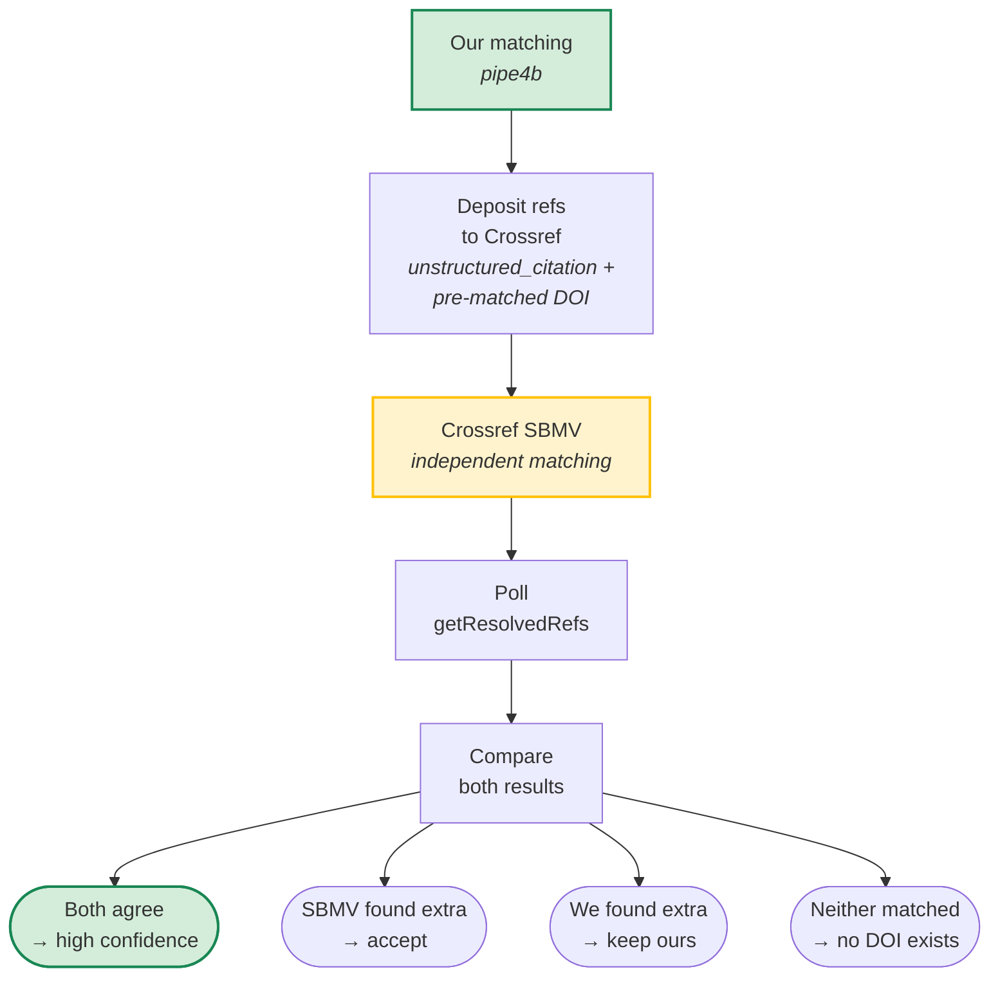

# Crossref Reference Linking

How we match extracted references against Crossref DOIs to enrich citation metadata.

## Background

[Crossref Reference Linking](https://www.crossref.org/services/reference-linking/) enables publishers to include DOIs in reference lists, creating persistent links between citing and cited works. This is an obligation of Crossref membership.

Our references are stored as plain text `<mixed-citation>` elements in JATS XML. `pipe4b_match_dois.py` queries the Crossref API to find DOIs for cited works, then writes them as `<pub-id pub-id-type="doi">` elements in JATS. This runs as step 8 in the pipeline — after citation extraction (pipe4), before galley HTML generation (pipe5). It's optional during QA iteration and typically run once when references are finalized.

## How it works



### Multi-query strategy

A single reference text often confuses Crossref due to translator credits, edition notes, and parenthetical asides. We query with up to 4 variants and pick the best result across all:

1. **Original text** — the full `<mixed-citation>` content
2. **Cleaned** — strips `[bracketed years]`, `(eds.)`, `Trans. Name, I.` noise
3. **Restructured** — for editor-led "In Author. Book." references, extracts the main work (only when the reference explicitly leads with `(eds.)` or `(trans.)`)
4. **Minimal** — just `"Surname Title"` — catches cases where all other queries are too noisy

### Scoring

Each Crossref candidate is scored on three signals:

| Signal | What it checks | Why it matters |
|--------|---------------|----------------|
| **Title similarity** | Does the Crossref title appear within the reference text? `&` normalised to `and`. | Primary correctness signal |
| **Author match** | Does any Crossref author surname appear in the reference? | Catches reviews (reviewer ≠ cited author) |
| **Type mismatch** | Is a book reference matched to a `journal-article` or unrelated `book-chapter`? | Catches journal reviews of books |

Results are either **`matched`** (written to JATS) or **`no_match`** (skipped). When multiple candidates exist, we pick matched over no_match, then by title similarity, then by Crossref score.

### JATS format

Before:
```xml
<ref id="ref1">
  <mixed-citation>Barnett, L. (2009). When Death Enters the Therapeutic Space. London: Routledge.</mixed-citation>
</ref>
```

After:
```xml
<ref id="ref1">
  <mixed-citation>Barnett, L. (2009). When Death Enters the Therapeutic Space. London: Routledge.</mixed-citation>
  <pub-id pub-id-type="doi">10.4324/9780203891285</pub-id>
</ref>
```

The `<pub-id>` is a sibling of `<mixed-citation>`, preserving the plain-text citation. Valid JATS 1.3. Downstream `pipe6_ojs_xml.py` only reads `mixed-citation.text`, so the new element is ignored. On rerun, refs with existing `<pub-id>` are skipped (no duplicate queries).

### Caching

Results are written to `doi_matches.json` in each volume directory (alongside `toc.json`). On rerun, already-matched refs are skipped — no duplicate Crossref queries. The file records the tier, DOI, Crossref score, title similarity, and whether the DOI has been written to JATS.

## Usage

```bash
# Single article, verbose
python3 backfill/html_pipeline/pipe4b_match_dois.py \
  --volume 35.1 --article 02-who-do-we-think-we-are \
  --verbose --email user@example.com

# Full issue
python3 backfill/html_pipeline/pipe4b_match_dois.py \
  --volume 35.1 --verbose --email user@example.com

# All volumes
for dir in backfill/private/output/*/; do
  python3 backfill/html_pipeline/pipe4b_match_dois.py \
    --volume "$(basename "$dir")" --email user@example.com
done

# Dry run (query only, don't write)
python3 backfill/html_pipeline/pipe4b_match_dois.py \
  --volume 35.1 --dry-run --verbose --email user@example.com
```

**Rate limiting:** 10 req/sec (100ms delay). Full corpus (~15k refs) takes ~25 minutes.

## Lessons learned

### What matches well

- **Books from academic publishers** (Routledge, Cambridge UP, Yale UP, Springer) — high match rates
- **Book chapters** with their own DOIs — distinctive titles
- **Journal articles** — strong match when the reference includes journal name + volume/issue
- **Titles with `&`** — normalised to `and` for comparison (e.g. "Being & Nothingness" matches "Being and Nothingness")

### What doesn't match

- **Trade publisher books** — Vintage, Gallimard, Grasset, Penguin etc. rarely register DOIs. Correct no-matches.
- **Pre-1990 books** — Heinemann, Harper, older Methuen editions typically have no DOIs.
- **German/French books from small publishers** — rarely in Crossref.

### False positive patterns we catch

| Pattern | Example | Detection |
|---------|---------|-----------|
| Journal review of a book | "Tête-à-Tête" review in *World Literature Today* | Type mismatch: book ref + `journal-article` result |
| Chapter from a different book | "SIMONE DE BEAUVOIR AND JEAN-PAUL SARTRE" chapter | Type mismatch: standalone book ref + `book-chapter` result |
| Short title coincidence | "Heidegger" (1 word) matches any ref mentioning Heidegger | Short title penalty: 1-2 word titles get similarity halved |

### Edition policy

A DOI to a different edition of the same work is acceptable. The reference text already specifies which edition was cited; the DOI helps the reader find the work. We only reject DOIs that point to a genuinely different work.

## Hybrid approach with Crossref SBMV (planned)

After our matching, we deposit references to Crossref and poll for their independent Search-Based Matching with Validation ([SBMV](https://www.crossref.org/blog/reference-matching-for-real-this-time/)) results:



### Comparison results

Clean test on vol 20.1 (202 refs, deposited without DOI hints):

| | Count |
|---|---|
| Both agree | 27 |
| **We found, SBMV didn't (yet)** | **41** |
| SBMV found, we didn't | 2 |
| Neither | 132 |

Our multi-query approach finds significantly more DOIs than SBMV's immediate matching. SBMV resolves some refs instantly, others go to `stored_query` and may resolve hours or days later — but our matching gives results immediately and catches noisy references that SBMV struggles with.

**Important:** When depositing with pre-matched DOIs, SBMV appears to just confirm them rather than independently matching. A clean comparison (no DOI hints) is needed to see SBMV's actual independent performance.

The Crossref deposit schema (5.4.0) supports both `<doi>` and `<unstructured_citation>` in the same `<citation>` element. We deposit our pre-matched DOI so Cited-by links work immediately, while SBMV may find additional matches over time.

SBMV requires Crossref member credentials and references must be deposited first.

## Displaying DOIs in OJS

Matched DOIs are stored in the OJS `citation_settings` table:

```sql
INSERT INTO citation_settings (citation_id, locale, setting_name, setting_value, setting_type)
VALUES (123, '', 'crossref::doi', '10.1234/example', 'string');
```

The [pkp/crossrefReferenceLinking](https://github.com/pkp/crossrefReferenceLinking) plugin (v3.0.0-1 for OJS 3.5) renders these as clickable DOI links on article pages via a `Templates::Article::Details::Reference` template hook.

### Gotcha: display requires Crossref credentials

The unpatched plugin only registers its display hook when Crossref credentials (username/password) are configured in the OJS Crossref export plugin. Without credentials, matched DOIs exist in the database but are invisible on article pages — no error, no warning, just silent failure.

**Our patch** (`docker/ojs/patches/crossref-ref-linking-display.php`) moves the display hook registration before the credentials check. DOIs render regardless of credentials. Credentials are only needed for depositing references and polling `getResolvedRefs`, not for displaying already-matched DOIs.

### End-to-end flow

```
pipe4b matches DOIs → JATS <pub-id> + doi_matches.json
         ↓
Script writes to OJS citation_settings table (crossref::doi key)
         ↓
pkp/crossrefReferenceLinking plugin renders DOI links on article pages
         ↓
OJS Crossref plugin deposits references to Crossref (includes matched DOIs)
         ↓
Crossref SBMV may find additional matches over time
```

For the **backfill** (existing articles): our script writes DOIs to `citation_settings` by matching JATS refs to OJS citations via `seq` number.

For **future articles**: the pkp/crossrefReferenceLinking plugin handles the full cycle automatically (deposit → poll → store → display).

## Development history

Built iteratively using TDD on real references (2026-04-02):

1. **Started simple** — single Crossref query, top result only, three tiers (matched/review/no_match). Tested on 9 refs from one article. 4/9 matched, but 2 were false positives (journal reviews of books).
2. **Added type mismatch detection** — catches `journal-article` results for book references. Eliminated false positives. 100% precision.
3. **Added author matching** — catches reviews where the reviewer name doesn't match the cited author. Further reduced false positives.
4. **Multi-query strategy** — original query alone missed noisy references (translator credits, edition notes). Added cleaned, restructured, and minimal variants. Gained 4 more matches (ref3–ref6 from first article).
5. **Ampersand normalisation** — `&` → `and` in title comparison. Gained 3 matches on second article (Being & Nothingness, Existentialism & Humanism, Subjectivity & Selfhood).
6. **Simplified to two tiers** — removed "review" tier since there's no per-reference review mechanism. Everything is either matched or no_match.
7. **SBMV comparison** — deposited refs to Crossref, polled `getResolvedRefs`. Initial test with DOI hints showed 100% agreement, but this was misleading — SBMV was just confirming our DOIs. Clean test (vol 20.1, no DOI hints) showed our matching finds 41 DOIs that SBMV hadn't found (yet), while SBMV found only 2 we missed.
8. **Short title penalty refined** — changed from penalising 1-2 word titles to only 1-word titles. 2-word titles like "Cartesian Meditations" and "Why Heidegger?" are distinctive enough. Gained ~5 matches on vol 12.1.
9. **Crossref score floor lowered** — from 30 to 20 for exact title containment (sim=1.0) + author match. Gained Tillich "Courage to Be" and May "Meaning of Anxiety".
10. **Named constants** — replaced magic numbers with `MIN_SCORE_EXACT_TITLE`, `MIN_SCORE_HIGH_SIM`, `MIN_SCORE_MED_SIM`, `SINGLE_WORD_TITLE_PENALTY`.

11. **Spot-check round 1** (30 random matches) — found 9 false positives: `reference-entry` (encyclopedia entries about authors), `dataset` (APA PsycINFO records). Added type rejection for `reference-entry`, `dataset`, `component`.
12. **Spot-check round 2** (30 random) — found 1 false positive: journal article ref matched to book-chapter by same author. Added journal-signal + book-chapter mismatch detection.
13. **Spot-check round 3** (30 random) — found 1 false positive: book ref matched to entry in "The Merleau-Ponty Dictionary". Added reference work container check (Dictionary/Companion/Encyclopedia/Handbook).
14. **Spot-check round 4** (30 random) — **30/30 clean**. No false positives.
15. **OJS integration** — installed pkp/crossrefReferenceLinking plugin, patched display hook to work without Crossref credentials. Verified DOI links render on article pages.
16. **Concurrent queries** — multi-query variants now run in parallel (ThreadPoolExecutor). ~3x faster.
17. **Existing DOIs extracted** — refs with DOIs already in the text now get a `<pub-id>` written to JATS (structured data), not just skipped.
18. **Full corpus run** (2026-04-02) — all 68 volumes processed.

### Full corpus results

| | Count | % |
|---|---|---|
| Total references | 15,911 | |
| Matched by our algorithm | 6,100 | 38% |
| Already had DOI in text | 625 | 4% |
| **Total with DOI** | **6,725** | **42%** |
| No match | 9,178 | 58% |

4 rounds of 30-match spot-checks during development. Final round: 100% precision. All DOIs written to JATS as structured `<pub-id>` elements.

## Testing

- **Unit tests** (`backfill/tests/test_crossref.py`): scoring logic, DOI detection, type mismatch, author matching — mocked, no API calls.
- **Live API tests** (`backfill/tests/test_crossref_live.py`): 9 references from a real article, asserting correct tier for each.

## References

- [Crossref Reference Linking](https://www.crossref.org/services/reference-linking/)
- [Crossref REST API](https://www.crossref.org/documentation/retrieve-metadata/rest-api/)
- [SBMV algorithm — "Matchmaker, matchmaker"](https://www.crossref.org/blog/matchmaker-matchmaker-make-me-a-match/) (Nov 2018)
- [SBMV benchmarks — "Reference matching: for real this time"](https://www.crossref.org/blog/reference-matching-for-real-this-time/) (Dec 2018)
- [OpenAPC doi-reverse-lookup](https://openapc.github.io/general/openapc/2018/01/29/doi-reverse-lookup/) — comparable Python approach
- [Crossref deposit schema 5.4.0](https://www.crossref.org/documentation/schema-library/markup-guide-metadata-segments/references/)
- [Register your references program](https://www.crossref.org/community/special-programs/register-references/)
- [RBoelter/citations](https://github.com/RBoelter/citations) — OJS Cited-by plugin (depends on deposited references)
