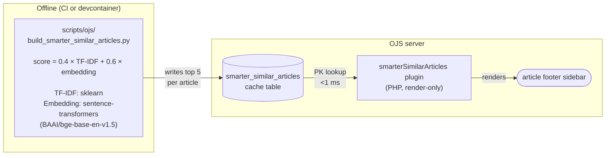

# Smarter Similar Articles Plugin

Drop-in replacement for the stock [Similar Articles](https://github.com/pkp/ojs/tree/main/plugins/generic/recommendBySimilarity) plugin. Pre-computes article similarity offline using a hybrid of TF-IDF and sentence embeddings, then serves the "Related articles" sidebar from a cache table at render time — one primary-key lookup, sub-millisecond, regardless of corpus size or shape.

## Why use this instead of the stock plugin

The stock plugin finds related articles by looking for keyword overlap between the one being viewed and the rest of the journal, searching anew each time a reader opens a page. For most journals that works — but on a thematically narrow corpus, where a handful of terms appear in almost every article (an existentialism journal where "existential" is everywhere, an oncology journal where "cancer" is), the search slows down sharply and can take the site down under load. See [`docs/ojs-issues-log.md`](ojs-issues-log.md) #26 for the incident that prompted this plugin.

For any OJS journal, this plugin is better on three axes:

1. **Faster.** Similarity is computed once offline on a schedule (usually nightly) and cached. The article page just looks up the pre-computed neighbours, so load time stays constant regardless of how big the journal grows.
2. **Smarter.** The stock plugin only sees exact word overlap. This one combines two signals: shared terminology (catches proper nouns, rare keywords, specific phrases) and how closely two articles match in meaning (catches papers about the same concept even when the vocabulary differs). The sidebar finds conceptually close papers, not just ones that happen to share common words.
3. **Tunable.** Score thresholds, blend weights, section rules, and the underlying AI model are all constants in a single Python file. You can trade precision for breadth, retune for your corpus, or swap the model without touching live.

Trade-offs: the offline build needs Python + sentence-transformers on whatever host runs the rebuild (not the OJS server itself). The cache is scheduled rather than live, so a newly-published article's sidebar has up-to-cache-age staleness. For most journals that's fine; if not, trigger a targeted recompute on publish.

It's an **optional, separate** plugin. The stock `recommendBySimilarity` stays installed; disable it in the OJS admin when you enable this one.

## Requirements

- OJS 3.5+
- Python 3.10+ with `scikit-learn`, `pymysql`, `beautifulsoup4`, `sentence-transformers` (only on the host that runs the offline build, not the OJS server). `sentence-transformers` pulls in `torch` (~800 MB) plus the `bge-base-en-v1.5` model (~440 MB, cached to `~/.cache/huggingface` on first load).
- SSH or direct MySQL access from the build host to the OJS database

## Architecture



- Plugin code is render-only. All analysis happens offline.
- TF-IDF catches distinctive-string matches (proper nouns, rare keywords). Embeddings catch semantic neighbours that share no tokens. The weighted sum keeps both sources of signal.
- The cache table `smarter_similar_articles` holds up to 5 rows per submission (empty when no match scores above `MIN_SCORE`).
- The builder is idempotent: a single transaction deletes then re-inserts either the whole table or just the affected submissions.

## Installation

### Docker (dev)

Already configured in `docker-compose.yml`:

```yaml
- ./plugins/smarter-similar-articles:/var/www/html/plugins/generic/smarterSimilarArticles
```

After the mount is in place, install the plugin (runs the migration):

```bash
docker compose exec ojs php lib/pkp/tools/installPluginVersion.php \
  /var/www/html/plugins/generic/smarterSimilarArticles/version.xml
```

Enable it in OJS admin: **Website > Plugins > Generic > Smarter Similar Articles** → tick. Disable the stock **Recommend Articles by Similarity** plugin at the same time.

### Manual (non-Docker / live)

1. Copy `plugins/smarter-similar-articles/` to `plugins/generic/smarterSimilarArticles/` in your OJS installation. Folder must be exactly `smarterSimilarArticles` (camelCase) or OJS autoloading will not find the plugin class.
2. Install the plugin:
   ```bash
   php lib/pkp/tools/installPluginVersion.php \
     plugins/generic/smarterSimilarArticles/version.xml
   ```
3. Enable in OJS admin: **Website > Plugins > Generic > Smarter Similar Articles**.
4. Disable the stock **Recommend Articles by Similarity** plugin at the same time to avoid double-rendering.
5. Run the offline builder once to populate the cache (see next section). Until it runs, the sidebar is silently absent on all articles.

## Running the offline builder

`scripts/ojs/build_smarter_similar_articles.py` connects to the OJS database, reads every published submission's title + abstract + curated keywords + section, computes both TF-IDF and embedding similarity, blends them as `0.4 × TF-IDF + 0.6 × embedding`, takes the top 5 neighbours, and writes the result to `smarter_similar_articles`.

Runtime on ~1400 submissions: ~2.5 min (TF-IDF ~1s, embedding compute ~115s on CPU, model load ~20s on first run). Subsequent runs with the model cached to `~/.cache/huggingface`: same — the model is loaded into memory each run, there's no persistent server. If you run nightly this is fine; if you run on every article publish, consider either a long-lived worker or switching `EMBED_MODEL` to MiniLM-L6-v2 for faster inference.

### Configure targets

The script has a `TARGETS` dict near the top:

```python
TARGETS = {
    'dev':  ['docker', 'compose', 'exec', '-T', 'ojs-db',
             'bash', '-c',
             'mysql -u root -p$MYSQL_ROOT_PASSWORD $MYSQL_DATABASE -N --raw'],
    'live': ['ssh', 'sea-live',
             'cd /opt/pharkie-ojs-plugins && docker compose exec -T ojs-db '
             "bash -c 'mysql -u root -p$MYSQL_ROOT_PASSWORD $MYSQL_DATABASE -N --raw'"],
}
```

Adapt to your environment — change the SSH host, path, or DB command as needed. The script only expects each target to pipe SQL in and tab/JSON output back.

### Run it

```bash
# Full rebuild against dev — needs sudo because docker-in-devcontainer
# requires it for the local `docker compose exec` path
sudo python3 scripts/ojs/build_smarter_similar_articles.py

# Full rebuild against live — do NOT sudo: the live target uses SSH
# (sea-live alias), and sudo strips the user's ~/.ssh/config
python3 scripts/ojs/build_smarter_similar_articles.py --target=live

# Recompute one article (e.g. just republished)
python3 scripts/ojs/build_smarter_similar_articles.py --target=live --submission=12345

# Recompute articles whose current cache points at 12345 (use after
# --submission when republishing with significant content changes)
python3 scripts/ojs/build_smarter_similar_articles.py --target=live --submission=12345 --affected-by=12345

# Compute but do not write — useful for validation
sudo python3 scripts/ojs/build_smarter_similar_articles.py --dry-run
```

A full rebuild on ~1400 submissions takes ~2 s (TF-IDF) + ~2 min (embedding compute, dominated by model load). Scales linearly; `numpy` handles a few-thousand-document similarity matrix in memory without issue.

### Schedule nightly rebuild

Put it in cron or a CI scheduled workflow. Below is a complete, copy-pasteable GitHub Actions workflow that mirrors what this repo runs against its own production (adapted here with generic names — substitute your host, user, and paths).

**`.github/workflows/rebuild-smarter-similar-articles.yml`** (in your deployment-ops repo — does NOT need to live alongside the plugin code; it just needs to `checkout` this public repo for the builder script):

```yaml
name: Rebuild smarter_similar_articles cache

on:
  schedule:
    - cron: '15 4 * * *'   # 04:15 UTC
  workflow_dispatch:

jobs:
  rebuild:
    runs-on: ubuntu-latest
    timeout-minutes: 15
    steps:
      - uses: actions/checkout@v5
        with:
          repository: <your-org>/<this-repo>
          ref: main

      - uses: actions/setup-python@v5
        with:
          python-version: '3.12'
          cache: 'pip'
          cache-dependency-path: scripts/ojs/requirements.txt

      - name: Cache HuggingFace model
        uses: actions/cache@v4
        with:
          path: ~/.cache/huggingface
          key: huggingface-bge-base-en-v1.5

      - name: Install Python deps
        run: pip install -r scripts/ojs/requirements.txt

      - name: Set up SSH
        run: |
          mkdir -p ~/.ssh
          echo "${{ secrets.SSH_DEPLOY_KEY }}" > ~/.ssh/id
          chmod 600 ~/.ssh/id
          cat > ~/.ssh/config <<EOF
          Host my-ojs-host
            HostName ${{ secrets.OJS_SSH_HOST }}
            User ${{ secrets.OJS_SSH_USER }}
            IdentityFile ~/.ssh/id
            StrictHostKeyChecking accept-new
          EOF
          chmod 600 ~/.ssh/config
          ssh-keyscan -H ${{ secrets.OJS_SSH_HOST }} >> ~/.ssh/known_hosts 2>/dev/null

      - name: Rebuild cache
        # `--target=live` uses the `sea-live` SSH alias by default; edit
        # the TARGETS dict in scripts/ojs/build_smarter_similar_articles.py to
        # match your host alias name, or pass one via --target
        run: python3 scripts/ojs/build_smarter_similar_articles.py --target=live

      - name: Clean up SSH key
        if: always()
        run: shred -u ~/.ssh/id 2>/dev/null || rm -f ~/.ssh/id
```

Secrets you'll need in the workflow's settings:
- `SSH_DEPLOY_KEY` — private key with write access to run the script on the OJS host
- `OJS_SSH_HOST` — hostname / IP of the OJS server
- `OJS_SSH_USER` — SSH user on the OJS host

The script runs on the CI runner (all Python deps installed there), opens an SSH tunnel to the OJS DB, and writes only the cache-table rows back. The OJS server itself needs no Python dependencies.

**Caching notes:**
- The `actions/setup-python` pip cache is keyed on `scripts/ojs/requirements.txt`. First run installs ~1 GB of torch + friends (~2 min); subsequent runs with the same requirements.txt restore wheels from cache (~10-15 s).
- The `actions/cache` step on `~/.cache/huggingface` persists the ~440 MB bge-base model across runs. First run downloads; subsequent runs restore.
- Net: first run ~5-6 min. Cached runs ~90 s + embedding compute.

## Configuration

The plugin itself has no admin UI. Tune the algorithm by editing `scripts/ojs/build_smarter_similar_articles.py`:

| Constant | Default | Effect |
|---|---|---|
| `TFIDF_WEIGHT` | `0.4` | Contribution of TF-IDF cosine to the final score. Higher = more precision on exact-string matches (hyphenated proper nouns, rare keywords). Should sum with `EMBED_WEIGHT` to 1. |
| `EMBED_WEIGHT` | `0.6` | Contribution of sentence-embedding cosine to the final score. Higher = more semantic breadth (catches topically-related papers that share no vocabulary). Embedding scores run in a higher band than TF-IDF, so at this default the blended score is embedding-dominated on matches where both agree. |
| `EMBED_MODEL` | `'BAAI/bge-base-en-v1.5'` | Sentence-transformers model. bge-base is 110M params, ~440 MB, ~2 min to encode 1400 docs on CPU. Chosen over MiniLM after corpus evaluation — notably better on philosopher clusters (Heidegger, Laing, Merleau-Ponty). For larger corpora (~10k+) where encoding time matters, switch to `'sentence-transformers/all-MiniLM-L6-v2'` (22M params, ~80 MB, ~15 s). |
| `KEYWORD_WEIGHT` | `3` | (TF-IDF only.) How many times the keyword list is repeated in the TF-IDF text blob. Higher = editor-curated keywords dominate over title/abstract. Does not affect embedding input. |
| `TITLE_WEIGHT` | `3` | (TF-IDF only.) How many times the title is repeated in the TF-IDF text blob. Raising clusters papers about the same person/concept more tightly for the TF-IDF contribution. Does not affect embedding input (the transformer understands title significance natively). |
| `MAX_RESULTS` | `5` | Sidebar size. Also hard-capped in the PHP render (`SmarterSimilarArticlesPlugin::MAX_RESULTS`). |
| `MIN_SCORE` | `0.40` | Hybrid-score floor. Matches below this are noise; excluded. Tuned against the bge-base hybrid score distribution (rank-1 avg 0.62, rank-5 avg 0.52). Well-clustered articles still get 5 neighbours; articles with no genuinely-close match get no sidebar. If you change the embedding model or the blend weights, retune — MiniLM scores lower and would want ~0.30. |
| `MAX_SCORE` | `0.95` | Duplicate-detection ceiling. Matches at or above this are near-identical in both TF-IDF and embedding space — duplicate imports. Excluded. |
| `RESTRICTED_SECTION_ABBREVS` | `{'BR'}` | Section abbrevs whose articles are restricted to same-section recommendations only. Adjust for your section naming. |

TF-IDF parameters (inside `compute_similarity()`):

| Parameter | Default | Effect |
|---|---|---|
| `stop_words` | `'english'` | Remove English stopwords ("the", "and", ...). |
| `min_df` | `2` | Drop terms appearing in only 1 article — noise. |
| `max_df` | `0.5` | **Critical**: drop terms appearing in >50% of corpus. This is what auto-filters corpus-wide tokens and keeps narrow-journal performance sane. |
| `ngram_range` | `(1, 2)` | Unigrams + bigrams — keeps phrases like "hermeneutic phenomenology" together. |

## Emergency rollback

If the sidebar is rendering bad results or the plugin is otherwise misbehaving on live, disable it in a single DB update — the render path short-circuits on the `enabled=0` flag and the article page renders with no sidebar.

```bash
ssh <your-host> 'cd /opt/<your-repo> && docker compose exec -T ojs-db \
  bash -c "mariadb -u\$MYSQL_USER -p\$MYSQL_PASSWORD \$MYSQL_DATABASE -e \
  \"UPDATE plugin_settings SET setting_value = 0 \
    WHERE plugin_name = '\''smartersimilararticlesplugin'\'' \
    AND setting_name = '\''enabled'\'';\""'
```

Article pages resume rendering within seconds — no container restart needed.

**Do not re-enable stock `recommendBySimilarity` on a thematically narrow corpus** (see `docs/ojs-issues-log.md` #26) — the stock plugin will reintroduce the 60-2000s live-query regression. If you need a sidebar back urgently, leave both off; the article footer simply has no "Related articles" section.

To fully remove the plugin: disable it, then drop the table:

```sql
DROP TABLE smarter_similar_articles;
```

The plugin code can stay in place — disabled + table-gone = effectively uninstalled. A later re-install via `installPluginVersion.php` will re-create the table.

## Post-restore from backup

If the OJS database is restored from a backup, the `smarter_similar_articles` cache rows are restored along with it — but they reflect the state at backup time. If articles were published/edited since the backup, the cache will contain references to submission IDs that no longer exist (or miss new ones).

Recovery: run a full rebuild immediately after restore.

```bash
python3 scripts/ojs/build_smarter_similar_articles.py --target=<host>
```

The render path handles missing submission IDs gracefully (silently drops them), but leaving the cache stale means readers see a narrower or possibly-empty sidebar until the next scheduled rebuild.

## Monitoring

`scripts/monitoring/monitor-deep.sh` runs these checks (added for this plugin):

- **Cache coverage**: `SELECT COUNT(DISTINCT submission_id) FROM smarter_similar_articles` vs published submissions. Fails if <50%, warns if <80%. A healthy state is ~93-95% (some articles legitimately have no match above `MIN_SCORE`).
- **Cache staleness**: oldest `computed_at` in the table. Fails if >7 days, warns if >48h. Catches silent failure of the nightly rebuild.

Both checks skip silently on targets that don't have the `smarter_similar_articles` table (i.e. the plugin isn't installed there).

## Troubleshooting

**Sidebar doesn't appear on any article.**

1. Plugin enabled? `SELECT * FROM plugin_settings WHERE plugin_name = 'smartersimilararticlesplugin' AND setting_name = 'enabled'` should return `1`.
2. Cache populated? `SELECT COUNT(*) FROM smarter_similar_articles` should be > 0.
3. Smarty compile cache stale? `rm -rf cache/t_compile/*` (inside the OJS container).
4. Migration ran? `SHOW TABLES LIKE 'smarter_similar_articles'` should return a row.

**Sidebar absent on a specific article.**

Expected on ~6% of articles at the default `MIN_SCORE=0.30`: if the article has no neighbour scoring above the hybrid floor, it has no sidebar. The plugin deliberately renders nothing rather than showing filler. Lower `MIN_SCORE` if you'd rather see weaker matches.

**Neighbours look unrelated.**

Likely causes:
- The article has very sparse text (no abstract, short title, no curated keywords). Both TF-IDF and the embedding model can only work with what's there.
- A keyword you think is distinctive is in fact corpus-wide. The TF-IDF side handles this via `max_df=0.5`. The embedding side doesn't — if the corpus is narrow, embeddings may cluster too broadly on the shared topic.
- You may be hitting an area where embeddings dominate the hybrid score but miss the specific connection TF-IDF would have caught. Shift to `TFIDF_WEIGHT=0.6, EMBED_WEIGHT=0.4` or further and rebuild.

Raise `KEYWORD_WEIGHT` / `TITLE_WEIGHT` if proper-noun matches should carry more weight on the TF-IDF side.

**Duplicates appearing in a sidebar.**

`MAX_SCORE` should filter score-1.0 matches (identical text blobs). If near-duplicates at 0.93-0.95 leak through, lower `MAX_SCORE` to 0.90.

## Comparison with stock `recommendBySimilarity`

|  | Stock `recommendBySimilarity` | `smarterSimilarArticles` (this plugin) |
|---|---|---|
| Where similarity is computed | On every article view, in SQL | Once, in Python, offline |
| Algorithm | Raw term presence across submission_search_objects + title LIKE + author LIKE | Hybrid: 0.4 × TF-IDF cosine + 0.6 × MiniLM embedding cosine |
| Semantic matching | No — lexical tokens only | Partial — MiniLM handles cases where two papers use different words for the same concept |
| Query at render time | Multi-JOIN + LIKE `%...%` full-table scans | Primary-key lookup against `smarter_similar_articles` |
| Corpus-skew behaviour | Collapses (60-2000s per query) | Unaffected — TF-IDF's `max_df` filters global tokens; embedding scores don't depend on corpus skew |
| Freshness on publish | Immediate | Up to nightly-rebuild interval (typically 24h) |
| Plugin settings UI | Yes (number of recommendations) | No — tune via `build_smarter_similar_articles.py` constants |
| Dependencies on build host | None (everything runs in OJS container) | Python + `scikit-learn` + `sentence-transformers` (~1 GB torch) |
| Dependencies on OJS server | Core OJS | Core OJS only — build host can be anywhere with DB access |
| OJS version | 3.x | 3.5+ (uses Laravel migrations) |
