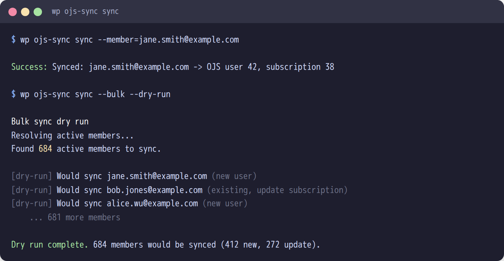
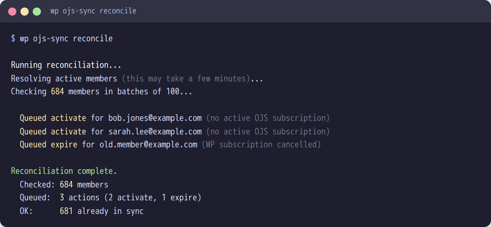

# WP-CLI Reference: wpojs-sync

> **What is WP-CLI?** [WP-CLI](https://wp-cli.org/) is the command-line tool for managing WordPress. These commands run on the server (or inside the Docker container) — not from your browser. In the Docker setup: `docker compose exec wp wp ojs-sync <command>`

All commands are under the `wp ojs-sync` namespace.

> **Most common commands:** `test-connection` (verify OJS is reachable), `status` (check sync health), `sync --member=email` (sync one person).

<table><tr><td>

## sync

Bulk sync all active members to OJS, or sync a single member.

```bash
# Sync a single member by ID or email
wp ojs-sync sync --member=42
wp ojs-sync sync --member=member@example.com

# Bulk sync all active members (--bulk required)
wp ojs-sync sync --bulk --dry-run
wp ojs-sync sync --bulk --yes

# Resume an interrupted bulk sync
wp ojs-sync sync --bulk --resume

# Control batch progress logging interval
wp ojs-sync sync --bulk --batch-size=100
```

</td><td width="45%">



</td></tr></table>

| Flag | Description |
|---|---|
| `--member=<id-or-email>` | Sync a single member by WP user ID or email |
| `--bulk` | Sync all active members (required for bulk sync) |
| `--dry-run` | Report what would happen, no changes |
| `--batch-size=<n>` | Progress logging interval (default: 50) |
| `--yes` | Skip confirmation prompt (only with `--bulk`) |
| `--resume` | Resume from last checkpoint (stored as a transient) |

Bulk sync uses adaptive throttling based on OJS response times. If OJS responds in <200ms, no delay. If OJS slows down, delays mirror the response time. If OJS returns 429, the `Retry-After` header value is respected. Sends WP password hashes so members can log in to OJS with their existing credentials.

<table><tr><td>

## test-connection

Two-step connectivity check against OJS.

```bash
wp ojs-sync test-connection
```

1. **Ping** -- checks OJS reachability (no auth)
2. **Preflight** -- validates API key authentication, IP allowlisting, and plugin compatibility

</td><td width="45%">


</td></tr></table>

<table><tr><td>

## status

Shows sync health overview.

```bash
wp ojs-sync status
```

Displays:
- Action Scheduler queue counts (pending, running, failed, complete)
- Active WP members count
- Members synced to OJS count
- Failures in last 24 hours
- Cron schedule (next reconciliation, daily digest, log cleanup)

</td><td width="45%">


</td></tr></table>

<table><tr><td>

## reconcile

Run reconciliation on demand (same logic as the daily cron).

```bash
wp ojs-sync reconcile
```

Batch-queries OJS for subscription status of all active WP members, queues activate/expire actions for any drift found.

</td><td width="45%">



</td></tr></table>
